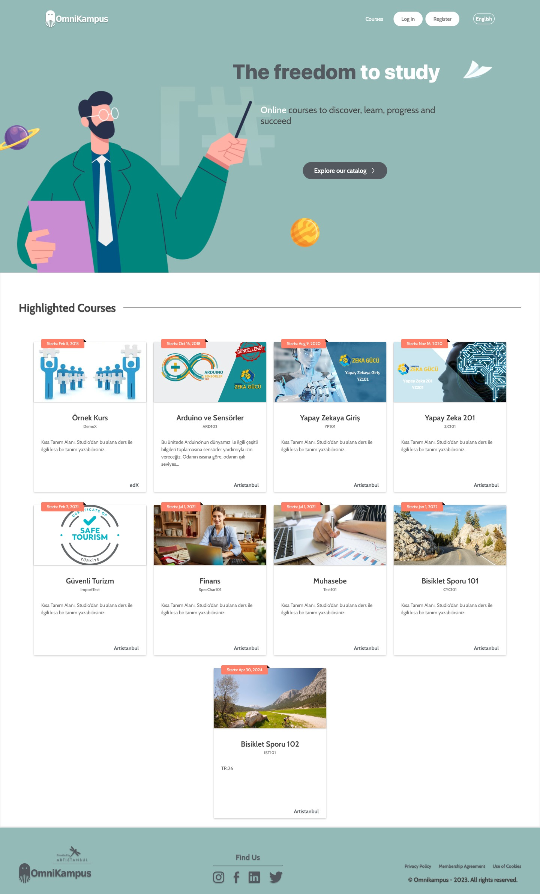

# OmniKampus Ege

# Screenshot

<h1 align="center">
  
</h1>

# Description

Inspired by the uniquely green Aegean landscape, this theme reflects nature in its most natural and simple form.

# Demo

https://demo.omnikampus.com/

# Installation

## For Tutor:

After adding the theme to the `env/build/openedx/themes/` folder, build with `tutor images build openedx`. Reboot with a new image `tutor local start -d` then use `tutor local do settheme theme-name` to activate the theme.

## For Devstack:

Add the theme to the `devstack/edx-platform/themes` folder.

in **devstack.py**

```
#from .common import _make_mako_template_dirs
#ENABLE_COMPREHENSIVE_THEMING = True
#COMPREHENSIVE_THEME_DIRS = [
#    "/edx/app/edxapp/edx-platform/themes/"
#]
#TEMPLATES[1]["DIRS"] = _make_mako_template_dirs
#derive_settings(__name__)
```

remove comments.

```
from .common import _make_mako_template_dirs
ENABLE_COMPREHENSIVE_THEMING = True
COMPREHENSIVE_THEME_DIRS = [
    "/edx/app/edxapp/edx-platform/themes/"
]
TEMPLATES[1]["DIRS"] = _make_mako_template_dirs
derive_settings(__name__)
```

It should look like above.

After that:

```
make dev.static.lms
make lms-restart
```

Then add the theme with **_add_** in **_site themes_** from **_admin panel_**.

For example "dark-theme" or "red-theme" or "my-theme"

## Open edX Tested Versions:

- Palm
- Quince
- Redwood
